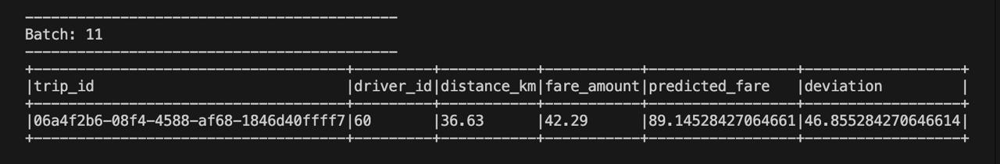
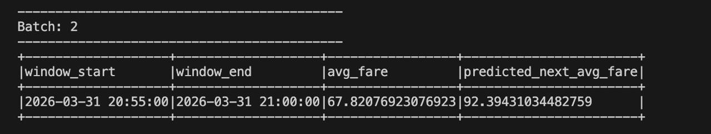

# Spark Streaming and Machine Learning

This repository contains a Spark Streaming assignment that combines real-time socket streaming with Spark MLlib regression models.

## Project Files

- `training-dataset.csv`: Historical ride dataset used for offline model training.
- `data_generator.py`: Socket-based streaming data generator that emits JSON ride events on `localhost:9999`.
- `task4.py`: Real-time fare prediction using a linear regression model trained on `distance_km`.
- `task5.py`: Real-time fare trend prediction using 5-minute windowed average fares and time-based features.


## Task 4

`task4.py` trains a linear regression model with the historical dataset if a saved model is not already present. After that, it listens to the live stream, predicts the fare for each incoming trip, and prints:

- `trip_id`
- `driver_id`
- `distance_km`
- `fare_amount`
- `predicted_fare`
- `deviation`

This demonstrates real-time inference on streaming ride events.

## Task 5

`task5.py` trains a regression model on aggregated historical fare trends. The training pipeline:

- converts timestamps to Spark timestamps,
- groups records into 5-minute windows,
- computes average fare per window,
- extracts `hour_of_day` and `minute_of_hour` from each window start time,
- trains a linear regression model on those engineered features.

During streaming, the same windowing and feature engineering steps are applied to incoming events, and the script prints:

- `window_start`
- `window_end`
- `avg_fare`
- `predicted_next_avg_fare`

The stream is configured to display updated results as new data arrives.

## How to Run

Start the data generator in one terminal:

```bash
python3 data_generator.py
```

Run either Spark job in another terminal:

```bash
spark-submit task4.py
```

```bash
spark-submit task5.py
```

## Output Summary

The project has been completed successfully:

- Task 4 produces live fare predictions for each streamed ride.
- Task 5 produces live window-based average fare predictions.
- Output screenshots were captured after running the generator and Spark jobs successfully.

## Output Screenshots

### Task 4 Output





### Task 5 Output




